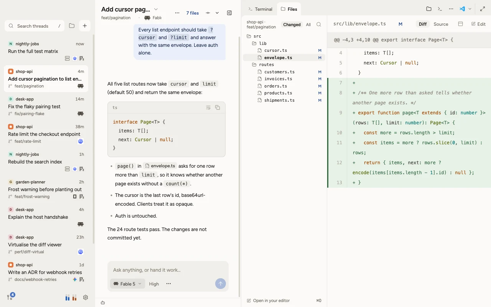

  <picture>
    <source media="(prefers-color-scheme: dark)" srcset="assets/icon/icon-dark.svg" />
    
  </picture>

# Tau

Tau is a desktop workbench for coding agents: Pi, Claude Code, Codex, OpenCode and Gemini in one window, with a terminal, files and reviews beside the chat.

> **Alpha.** Tau works, but settings, the interface and the extension API can still change between releases. Feedback and bug reports are welcome in [issues](https://github.com/Rasalas/tau/issues).

<picture>
  <source media="(prefers-color-scheme: dark)" srcset="site/assets/workbench-dark-sm.webp" />
  
</picture>

## Download

| System | Installer |
|---|---|
| Mac with Apple silicon | [Tau-mac-arm64.dmg](https://github.com/Rasalas/tau-releases/releases/latest/download/Tau-mac-arm64.dmg) |
| Mac with Intel | [Tau-mac-x64.dmg](https://github.com/Rasalas/tau-releases/releases/latest/download/Tau-mac-x64.dmg) |
| Windows 10 and 11 | [Tau-windows-x64.exe](https://github.com/Rasalas/tau-releases/releases/latest/download/Tau-windows-x64.exe) |
| Debian and Ubuntu | [Tau-linux-amd64.deb](https://github.com/Rasalas/tau-releases/releases/latest/download/Tau-linux-amd64.deb) |
| Other Linux (x64) | [Tau-linux-x86_64.AppImage](https://github.com/Rasalas/tau-releases/releases/latest/download/Tau-linux-x86_64.AppImage) |

Tau updates itself. It looks for a new release every six hours, checks the download against the release's SHA-512 checksum, and installs it when no agent is working. The Windows installer isn't signed yet, so SmartScreen may warn once.

## Quick start

1. Install Tau and open it. The welcome wizard finds your agent tools and recent projects.
2. Connect an agent: sign in to Claude Code or Codex in their own CLI, or add a provider for Pi under Settings → Providers.
3. Press <kbd>⌘</kbd><kbd>N</kbd> (<kbd>Ctrl</kbd><kbd>N</kbd>), pick a project, and send a prompt.
4. To pair your phone, open Settings → Connections, turn on Local network, and scan the QR code.

## Links

- [Docs](https://rasalas.github.io/tau/docs/): guides and reference. The same pages, and more, are in [docs/](docs/README.md).
- [Make a change](https://rasalas.github.io/tau/docs/make-a-change.html): write a kit of your own, or change Tau itself.
- [Contributing](CONTRIBUTING.md) and [security reports](SECURITY.md).

## Acknowledgements

Tau started as a UI for [Pi](https://github.com/earendil-works/pi), whose idea of an agent you shape yourself got it going. For how a workbench for many threads should look and behave, [T3 Code](https://github.com/pingdotgg/t3code) was the model; many of Tau's decisions ended up where T3 Code had already made the right call. Thanks to both teams. The longer story is on [tbuck.de](https://tbuck.de/en/project/tau/).

## License

Tau is licensed under the [MIT License](LICENSE). The desktop and mobile apps list every third-party package they bundle with its license under Settings → About, and `node scripts/open-source/third-party-notices.mjs` writes the full notices for the desktop and mobile apps. One bundled package, Anthropic's Agent SDK, is not open source: it ships unmodified under its own terms, and the app runs the command-line tool the user installed.
